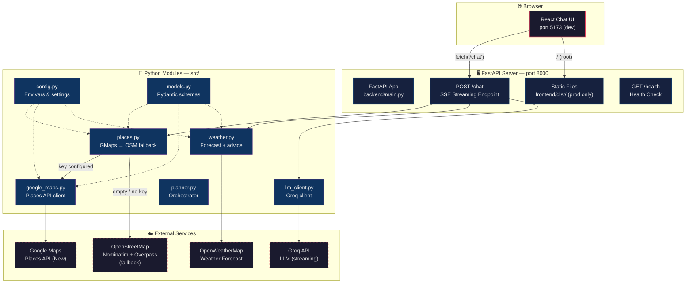
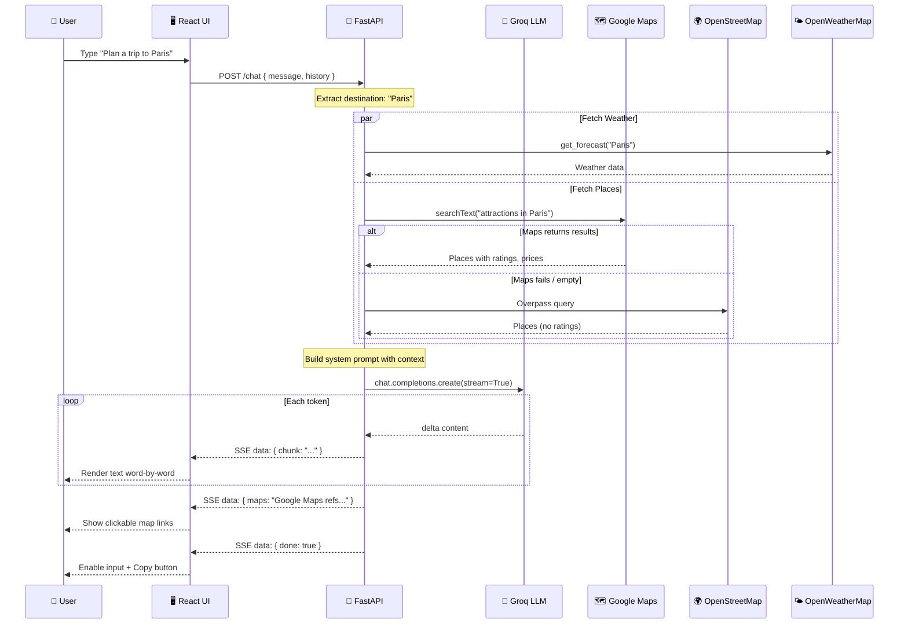
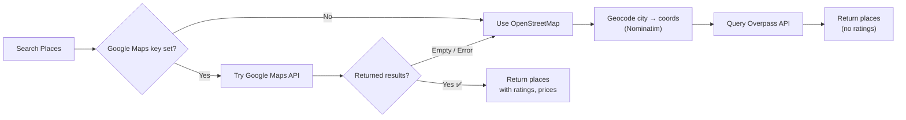

# Architecture

## System Overview



## Request Flow



## Streaming Format (SSE)

```
POST /chat  →  Server-Sent Events stream

data: {"chunk":"Paris"}
data: {"chunk":" is"}
data: {"chunk":" a"}
data: {"chunk":" beautiful"}
data: {"chunk":" city"}
data: {"maps":"Google Maps references:\n- Eiffel Tower: https://..."}
data: {"done":true}
```

## Place Lookup Fallback Chain



## Project Structure

```
travel-planner/
│
├── backend/
│   └── main.py              # FastAPI server — routes, SSE streaming, context building
│
├── frontend/                 # React + Vite
│   ├── src/
│   │   ├── App.jsx          # Chat UI — SSE reader, message renderer, linkify
│   │   ├── App.css          # Premium dark theme
│   │   └── main.jsx         # Entry point
│   ├── vite.config.js       # Proxy /chat → localhost:8000 (dev only)
│   └── package.json
│
├── src/                      # Shared Python modules
│   ├── config.py            # Environment variables from .env
│   ├── models.py            # Pydantic data models (Place, Weather, TravelPlan...)
│   ├── google_maps.py       # Google Maps Places API (New) client
│   ├── places.py            # Place lookup — GMaps first, OSM fallback
│   ├── weather.py           # OpenWeatherMap forecast + advice
│   ├── llm_client.py        # Groq LLM client
│   └── planner.py           # Orchestrator combining all sources
│
├── Dockerfile                # Single-image deploy (Python + Node + React build)
├── render.yaml               # Render blueprint (one-click deploy)
├── start.sh                  # Start app locally (dev or production mode)
├── stop.sh                   # Stop all processes
├── .env.example              # Template for API keys
├── requirements.txt
└── README.md
```

## Key Design Decisions

| Decision | Why |
|---|---|
| **SSE over WebSocket** | Simpler protocol, no extra library, works with `ReadableStream` in the browser |
| **Google Maps first → OSM fallback** | Google provides ratings, price levels, open/closed status; OSM is a reliable free fallback |
| **AsyncGroq with streaming** | Token-by-token responses for a smooth chat UX |
| **Single Docker image** | One service to deploy = simpler ops, fewer things to break |
| **FastAPI serves frontend** | No separate static hosting needed in production |
| **Pydantic models** | Type safety and validation shared across all modules |
